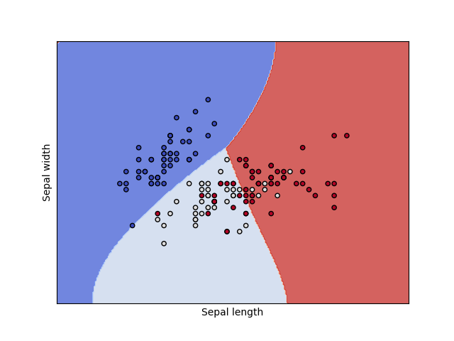

% Bowl Full of Lentils
% Fintan Halpenny
% June 24, 2019

# It Me


<!-- Slide Transition -->
# It Me

* Fintan Halpenny

<!-- Slide Transition -->
# It Me

* Fintan Halpenny

* Frequently known as fintan or finto online

<!-- Slide Transition -->
# It Me

* Fintan Halpenny

* Frequently known as fintan or finto online

* Work at Formation

<!-- Slide Transition -->
# Dhall


<!-- Slide Transition -->
# Dhall

* Dhall - The non-repetitive alternative to YAML

<!-- Slide Transition -->
# Dhall

* Dhall - The non-repetitive alternative to YAML

* You can think of Dhall as: JSON + functions + types + imports

<!-- Slide Transition -->
# Dhall

* Dhall - The non-repetitive alternative to YAML

* You can think of Dhall as: JSON + functions + types + imports

* Not Turing-complete


<!-- Slide Transition -->
# Dhall - Features

* Built-in types

<!-- Slide Transition -->
# Dhall - Features

* Built-in types

* Records

<!-- Slide Transition -->
# Dhall - Features

* Built-in types

* Records

* Unions

<!-- Slide Transition -->
# Dhall - Features

* Built-in types

* Records

* Unions

* Functions

<!-- Slide Transition -->
# Dhall - Features

* Built-in types

* Records

* Unions

* Functions

* Let/Imports

<!-- Slide Transition -->
# Bool - Type

```bash
$ dhall type <<< "True"
Bool
```

<!-- Slide Transition -->
# Bool - Examples

```bash
$ dhall <<< "True && False"
False
```

```bash
$ dhall <<< "True && True"
True
```

```bash
$ dhall <<< "True || False"
True
```

```bash
$ dhall <<< "False || False"
False
```

<!-- Slide Transition -->
# Natural - Type

```bash
$ dhall type <<< "0"
Natural
```

<!-- Slide Transition -->
# Natural - Examples

```bash
$ dhall <<< "1 + 1"
2
```

```bash
$ dhall <<< "1 + 0"
1
```

```bash
$ dhall <<< "1 * 1"
1
```

```bash
$ dhall <<< "1 * 0"
0
```

<!-- Slide Transition -->
# Integer - Type

```bash
$ dhall type <<< "-1"
Integer
```

<!-- Slide Transition -->
# Integer - Examples

```bash
$ dhall <<< "-1"
-1
```

```bash
$ dhall <<< "+1"
+1
```

```bash
$ dhall <<< "-1 + -2"
Use "dhall --explain" for detailed errors

Error: <+> only works on <Natural>s

-1 + -2

(stdin):1:1
```

<!-- Slide Transition -->
# Double - Type

```bash
$ dhall type <<< "3.14"
Double
```

<!-- Slide Transition -->
# Double - Examples

```bash
$ dhall <<< "3.14"
3.14
```

```bash
$ dhall <<< "Infinity"
Infinity
```

```bash
$ dhall <<< "-Infinity"
-Infinity
```

```bash
$ dhall <<< "3.14 * (3.0 * 3.0)"
Use "dhall --explain" for detailed errors

Error: <*> only works on <Natural>s

3.14 * (3.0 * 3.0)

(stdin):1:1
```


<!-- Slide Transition -->
# Text - Type

```bash
$ dhall type <<< '"Hello, World!"'
Text
```

<!-- Slide Transition -->
# Text - Examples

```bash
$ dhall <<< '"I <3 Dhall"'
"I <3 Dhall"
```

```bash
$ dhall <<< '"I" ++ " <3 " ++ "NYC"'
"I <3 NYC"
```

```bash
$ dhall
''
    #!/bin/bash

    echo "Hi!"
''
<Ctrl-D>
''
    #!/bin/bash

    echo "Hi!"
''
```


<!-- Slide Transition -->
# List - Type

```bash
$ dhall type <<< "[1, 2, 3]"
List Natural
```

<!-- Slide Transition -->
# List - Examples

```bash
$ dhall <<< "[1, 2, 3] # [4, 5, 6]"
[ 1, 2, 3, 4, 5, 6 ]
```

```bash
$ dhall <<< "
List/fold
  Bool
  [True, False, True]
  Bool
  (\(x : Bool) -> \(y : Bool) -> x && y)
  True
"
False
```

```bash
$ dhall <<< "List/length Natural [1, 2, 3]"
3
```


<!-- Slide Transition -->
# Optional - Type

```bash
$ dhall type <<< "None Natural"
Optional Natural
```

```bash
$ dhall type <<< "Some 1"
Optional Natural
```

<!-- Slide Transition -->
# Optional - Fold

```bash
$ dhall <<< '
Optional/fold
  Text
  (Some "ABC")
  Text
  (\(t : Text) -> t)
  "Uhoh"
'
"ABC"
```

# Optional - Fold
```bash
$ dhall <<< '
Optional/fold
  Text
  (None Text)
  Text
  (\(t : Text) -> t)
  "Uhoh"
'
"Uhoh"
```


<!-- Slide Transition -->
# Unit

```bash
$ dhall type <<< "{=}"
{}
```

```bash
$ dhall <<< "{=}"
{=}
```


<!-- Slide Transition -->
# Records - Type

```bash
dhall type <<< "
{ name : Text, age : Natural, email : Text }
"
Type
```

<!-- Slide Transition -->
# Records - Person

```bash
dhall <<< "
{ name : Text, age : Natural, email : Text }
"
{ age : Natural, email : Text, name : Text }
```

<!-- Slide Transition -->
# Records - Person Creation

```bash
dhall <<< '
{ name = "Fintan", age = 26, email = "finto@haps.com" }
'
{ age = 26, email = "finto@haps.com", name = "Fintan" }
```

<!-- Slide Transition -->
# Records - Person Type

```bash
dhall type <<< '
{ name = "Fintan", age = 26, email = "finto@haps.com" }
'
{ age : Natural, email : Text, name : Text }
```

<!-- Slide Transition -->
# Records - Example Type Annotation

```bash
dhall <<< '
{ name = "Fintan" } : { name : Text, age : Natural }
'
Error: Expression doesn\'t match annotation

{ + age : …
, …
}

{ name = "Fintan" } : { name : Text, age : Natural }
```

<!-- Slide Transition -->
# Records - Example Projection 1

```bash
dhall <<< '{ name = "Fintan", age = 26 }.age'
26
```

```bash
dhall <<< '{ name = "Fintan", age = 26 }.{ age, name }'
{ age = 26, name = "Fintan" }
```

<!-- Slide Transition -->
# Unions - Type

```bash
$ dhall type <<< "
< Monday
| Tuesday
| Wednesday
| Thursday
| Friday
>
"
Type
```

<!-- Slide Transition -->
# Unions - Example Enum

```bash
$ dhall <<< "
< Monday
| Tuesday
| Wednesday
| Thursday
| Friday
>
"
< Friday | Monday | Thursday | Tuesday | Wednesday >
```

<!-- Slide Transition -->
# Unions - Example Enum Constructor

```bash
$ dhall <<< "
< Monday
| Tuesday
| Wednesday
| Thursday
| Friday
>.Monday
"
<Friday | Monday | Thursday | Tuesday | Wednesday>.Monday
```

<!-- Slide Transition -->
# Unions - Example Eliminator

```bash
$ dhall <<< "
merge
{ Monday = True
, Tuesday = False
, Wednesday = False
, Thursday = False
, Friday = False
}
<Monday | Tuesday | Wednesday | Thursday | Friday>.Monday
"
True
```

<!-- Slide Transition -->
# Unions - Example Sum Type

```bash
$ dhall <<< "< IsNat : Natural | IsText : Text >"
< IsNat : Natural | IsText : Text >
```

```bash
$ dhall type <<< "
< IsNat : Natural | IsText : Text >.IsNat
"
  forall(IsNat : Natural)
→ < IsNat : Natural | IsText : Text >
```

<!-- Slide Transition -->
# Functions - Type

```bash
$ dhall type <<< "\(x : Natural) -> x + 1"
forall(x : Natural) → Natural
```

<!-- Slide Transition -->
# Functions - Example

```bash
$ dhall <<< "\(x : Natural) -> x + 1"
\(x : Natural) → x + 1
```

```bash
$ dhall <<< "(\(x : Natural) -> x + 1) 41"
42
```

<!-- Slide Transition -->
# Functions - Example Const

```bash
$ dhall <<< '
   ( \(a : Type)
  -> \(b : Type)
  -> \(x : a)
  -> \(y : b)
  -> x
   ) Text Natural "Ignored!" 17
'
"Ignored!"
```


<!-- Slide Transition -->
# Let/Imports - Examples

```bash
$ dhall <<< '
let identity = \(a : Type) -> \(x : a) -> x
in identity Text "It me!"
'
"It me!"
```

```bash
$ dhall <<< "
let enumerate = https://dhall/Prelude/Natural/enumerate
in enumerate 10
"
[ 0, 1, 2, 3, 4, 5, 6, 7, 8, 9 ]
```

```bash
$ dhall <<< "let f = ../identity in f Natural 42"
42
```


<!-- Slide Transition -->
# Machine Learning Configuration - SVM

* Support Vector Machine (SVM)

<!-- Slide Transition -->
# Machine Learning Configuration - SVM

* Support Vector Machine (SVM)

* Hyperparameter Learning

<!-- Slide Transition -->
# Machine Learning Configuration - SVM

* Support Vector Machine (SVM)

* Hyperparameter Learning

* Simple Script in Python using Scikit-Learn

<!-- Slide Transition -->
# Machine Learning Configuration - SVM



<!-- Slide Transition -->
# SVM - SVC Inputs

* C-Support Vector Classification

<!-- Slide Transition -->
# SVM - SVC Inputs

* C-Support Vector Classification

* `kernel`: Specifies the kernel type to be used in the algorithm. It must be one of ‘linear’, ‘poly’,
  ‘rbf’, ‘sigmoid’, ‘precomputed’ or a callable. If none is given, ‘rbf’ will be used.

<!-- Slide Transition -->
# SVM - SVC Inputs

* C-Support Vector Classification

* `kernel`: Specifies the kernel type to be used in the algorithm. It must be one of ‘linear’, ‘poly’,
  ‘rbf’, ‘sigmoid’, ‘precomputed’ or a callable. If none is given, ‘rbf’ will be used.

* `C`: Penalty parameter C of the error term.

<!-- Slide Transition -->
# SVM - SVC Inputs

* C-Support Vector Classification

* `kernel`: Specifies the kernel type to be used in the algorithm. It must be one of ‘linear’, ‘poly’,
  ‘rbf’, ‘sigmoid’, ‘precomputed’ or a callable. If none is given, ‘rbf’ will be used.

* `C`: Penalty parameter C of the error term.

* `gamma`: Kernel coefficient for ‘rbf’, ‘poly’ and ‘sigmoid’.

<!-- Slide Transition -->
# SVM - SVC Inputs

* C-Support Vector Classification

* `kernel`: Specifies the kernel type to be used in the algorithm. It must be one of ‘linear’, ‘poly’,
  ‘rbf’, ‘sigmoid’, ‘precomputed’ or a callable. If none is given, ‘rbf’ will be used.

* `C`: Penalty parameter C of the error term.

* `gamma`: Kernel coefficient for ‘rbf’, ‘poly’ and ‘sigmoid’.

* Call `fit` on `X` and `y` training data.


<!-- Slide Transition -->
# Trainer - JSON

```json
{ "kernel": "linear"
, "dataset": "Iris"
}
```

<!-- Slide Transition -->
# Trainer - JSON (But wait!)

```json
{ "kernel": "rbf"
, "dataset": "Iris"
}
```

<!-- Slide Transition -->
# Hyper-Parameters - JSON

* We can train on the two parameters `C` and `gamma`

<!-- Slide Transition -->
# Hyper-Parameters - JSON

* We can train on the two parameters `C` and `gamma`

* In JSON:

```json
{ "gamma": 0.1, "C": 0.1 }
```

<!-- Slide Transition -->
# Hyper-Parameters - JSON

* We can train on the two parameters `C` and `gamma`

* In JSON:

```json
{ "gamma": 0.1, "C": 0.1 }
```

* But we need more parameters:

```json
[ { "gamma": 0.1, "C": 0.1 }
, { "gamma": 0.1, "C": 1 }
, { "gamma": 0.1, "C": 10 }
, { "gamma": 0.1, "C": 100 }
, { "gamma": 0.1, "C": 1000 }
]
```

<!-- Slide Transition -->
# Hyper-Parameters - JSON

* We can train on the two parameters `C` and `gamma`

* In JSON:

```json
{ "gamma": 0.1, "C": 0.1 }
```

* But we need more parameters:

```json
[ { "gamma": 0.1, "C": 0.1 }
, { "gamma": 0.1, "C": 1 }
, { "gamma": 0.1, "C": 10 }
, { "gamma": 0.1, "C": 100 }
, { "gamma": 0.1, "C": 1000 }
]
```

* Now we want to increase `gamma` values as well, ohno!

<!-- Slide Transition -->
# Copy-Pasta

```json
[ { "gamma": 0.1, "C": 0.1 }
, { "gamma": 0.1, "C": 1 }
, { "gamma": 0.1, "C": 10 }
, { "gamma": 0.1, "C": 100 }
, { "gamma": 0.1, "C": 1000 }

, { "gamma": 1, "C": 0.1 }
, { "gamma": 1, "C": 1 }
, { "gamma": 1, "C": 10 }
, { "gamma": 1, "C": 100 }
, { "gamma": 1, "C": 1000 }

, { "gamma": 10, "C": 0.1 }
, { "gamma": 10, "C": 1 }
, { "gamma": 10, "C": 10 }
, { "gamma": 10, "C": 100 }
, { "gamma": 10, "C": 1000 }

, { "gamma": 100, "C": 0.1 }
, { "gamma": 100, "C": 1 }
, { "gamma": 100, "C": 10 }
, { "gamma": 100, "C": 100 }
, { "gamma": 100, "C": 1000 }
]
```


<!-- Slide Transition -->
# Trainer - Dhall

* `Kernel.dhall`:

```haskell
< RBF | Linear | Poly >
```

<!-- Slide Transition -->
# Trainer - Dhall

* `Kernel.dhall`:

```haskell
< RBF | Linear | Poly >
```

* `Dataset.dhall`:

```haskell
< Iris | Wine >
```

<!-- Slide Transition -->
# Trainer - Dhall

* `Kernel.dhall`:

```haskell
< RBF | Linear | Poly >
```

* `Dataset.dhall`:

```haskell
< Iris | Wine >
```

* `Trainer.dhall`:

```haskell
let Dataset = ./Dataset.dhall

let Kernel = ./Kernel.dhall

in  { dataset : Dataset, kernel : Kernel }
```


<!-- Slide Transition -->
# Hyper-Parameters - Dhall

* `Hyperparameters.dhall`:

```haskell
{ gamma : Double, C : Double }
```


<!-- Slide Transition -->
# Hyper-Parameters - Dhall

* `Hyperparameters.dhall`:

```haskell
{ gamma : Double, C : Double }
```

* We want a helper to create the equivalent of our set `gamma` value:


<!-- Slide Transition -->
# Hyper-Parameters - Dhall

* `Hyperparameters.dhall`:

```haskell
{ gamma : Double, C : Double }
```

* We want a helper to create the equivalent of our set `gamma` value:

```haskell
List/map
  Double
  Hyperparameters
  (\(C : Double) -> { gamma = 0.1, C = C })
  [ 0.1, 1, 10, 100, 1000 ]
```


<!-- Slide Transition -->
# Hyper-Parameters - Dhall

* `Hyperparameters.dhall`:

```haskell
{ gamma : Double, C : Double }
```

* Ok, how about the equivalent our big copy-pasta monster?


<!-- Slide Transition -->
# Hyper-Parameters - Dhall

* `Hyperparameters.dhall`:

```haskell
{ gamma : Double, C : Double }
```

* Ok, how about the equivalent our big copy-pasta monster?

```haskell
List/liftA2
  Double
  Double
  Hyperparameters
  (  \(gamma : Double)
  -> \(C : Double)
  -> { gamma = gamma, C = C }
  )
  [ 0.1, 1, 10, 100 ]
  [ 0.1, 1, 10, 100, 1000 ]
```


<!-- Slide Transition -->
# More Tasty Meals

* https://functional.works-hub.com/learn/bowl-full-of-lentils-fcbf3

* https://functional.works-hub.com/learn/yo-yoneda-a2965

* https://kowainik.github.io/posts/2018-09-09-dhall-to-hlint.html

* https://github.com/dhall-lang

<!-- Slide Transition -->
# Other Links

* https://scikit-learn.org/stable/index.html

* https://medium.com/all-things-ai/in-depth-parameter-tuning-for-svc-758215394769

<!-- Slide Transition -->
# Follow Me (But like, only if you want to)


