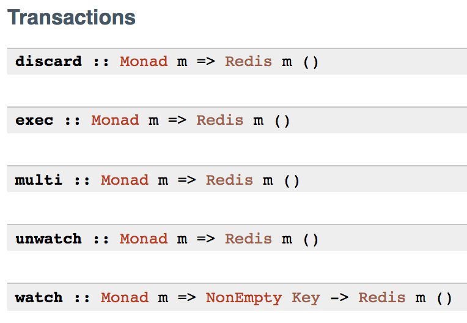

% Read the Functional Manual – But First We Have To Write It
% Fintan Halpenny
% June 4, 2018

# What we will go through

* Introduction to Myself

* Documentation in Haskell

* Tips, Tricks and Tools

* Call to Action

# This Guy


# This Guy

* Studied Computer Science in Trinity College, Dublin


# This Guy

* First exposure to Haskell in one of our modules

* Banged my head a bit more in the follow up module

* Began to see the light reading Haskell Programming From First Principles

# This Guy

* Three years of Python in LogoGrab, sneaking some Haskell in after a while


# This Guy

* Now working for Formation

* But the learning journey continues


# Functionally Dependent Documentation

* We're more functional when the documentation is good

* Documentation is the first point of contact

* Imagine trying to read the source code for EVERYTHING.

* Past Fintan can sometimes be smarter than Future Fintan. He should do him the courtesy of reminding him what he was doing.

* Open source documentation will encourage people to help out more.

# Finding the Needle in the Haystack

* When we are working on problems we should know how to search

* Search a package

* Search a module

* Search a function name

* Search a type signature

# How can we search documentation in Haskell?

* We will see a few options that I generally use

* Pick which one suits you best

* We can test the WiFi and do a search

# The OG: Hoogle

* http://haskell.org/hoogle

* First Haskell API Search Engine

* Searches Hackage

* Has a command line tool

# The Alt-Kid: (Reactive) Hoogle

* http://hoogle.haskell.org

* Very similar to original Hoogle

* Reactive interface, i.e. searches change as you type

* Results can differ

# The New Kid on the Block: Stackage

* http://stackge.org

* Searches Stackage snapshots

* Snapshots are the LTS resolvers you use with Stack

* Can explore snapshot libraries which is very useful
  * e.g. seeing the history of versions of a library

# Building a Framework to Work In

* It can be too easy to let documentation to slip

* We want to be able to have a way of thinking about documentation

* And create an iterative process of how we document

* Easiest way is to break up documentation into distinct categories

# Categories of Documentation

* So when I think about documentation, I think of a few categories

* Documentation through types

* Documentation through naming and descriptions

* Documentation through usage and tutorials

* Documentation through blog posts (similar to tutorials but more free form)


# Types as Documentation

* First let us look at a few problems

* What is the issue here:

```haskell
getUser :: Text -> Text -> IO User
```

* How many implementations does this have:

```haskell
arithmetic :: Int -> Int -> Int
```

* Types get us very far, but thankfully we can do better than the above

* Let us talk about domains

# Domain of Machine Integers

* What is our domain here?

```haskell
Int -> Int
```

# Domain of Natural numbers

* What is our domain here?

```haskell
Natural -> Natural
```

# Domain of Identity Computation and String of Characters

* What is our domain here?

```haskell
Identity String -> String
```

# Domain of Here be Dragons

* What is our domain here?

```haskell
IO String
```

# Domain of Database Interactions

* What is our domain here?

```haskell
DB User
```

# Constrain Domains

* We can constrain our domains using polymorphic and ad-hoc polymorphic functions

```haskell
-- only one reasonable thing to do
a -> a
-- once again we're constrained to only use `fmap` and we can't do anything with `a`
void :: Functor f => f a -> f ()
-- can follow the types to implement this
dimap :: (a -> b) -> (c -> d) -> (b -> c) -> a -> d
```

* So constraining the types we use benefits us as authors

# Revisit our Int Problem

* Before we had:

```haskell
arithmetic :: Int -> Int -> Int
```

* We can constrain that:

```haskell
arithmetic :: Num a => a -> a -> a
```

* Or even more:

```haskell
arithmetic :: Ring a => a -> a -> a
```

# Repurposing Domains

* We can be more specific about the domains we're working in

* `newtype` your `Text`, `String` and `Int` types!

# Pop Quiz

* Which is better?

```haskell
type Username = Text
```

```haskell
newtype Username = Username { unUserName :: Text }
```

# What's the Difference?

```haskell
type Username = Text
-- definition
lookupUser :: Username -> User

-- use
-- can use any kind of text
lookupUser "absolute-garabage"
```

```haskell
newtype Username = Username { unUserName :: Text }`
-- definition
lookupUser :: Username -> User

-- make sure we don't pass in garbage
validateUsername :: Text -> Validation Error Username

-- use
lookupUser <$> validateUsername "Fintan Halpenny"
```

# One More Example

```haskell
newtype Db a = Db
  { runDb :: Pool
          -> ReaderT SqlBackend (IO a)
  }
```

* We know that we're only interacting with DB related functionality and not just arbitrary IO

# Revisiting our getUser Problem

* We had:

```haskell
getUser :: Text -> Text -> IO User
```

* Learning from our `newtype` technique:

```haskell
newtype Username = Username { unUserName :: Text }

-- purposefully don't have a Show instance for Password
newtype Password = Password { unPassword :: Text }

newtype DB = { runDB :: etc. }

getUser :: Username -> Password -> DB User
```

# Real World Confusion

* I came across an instance of this in the wild

* No `newtype` and no documentation on parameters


* What is this `String`?

* Rumaging in the source code I eventually found


# Names and Descriptions



# Be Nice to Your Users

* We have written our functions

* Even come up with some name for them

* We _should_ describe what they do

* Even if it is a short description

* Let's talk about naming first

# Domains, Domains, Domains

* Talk the language of your domain, if possible

* This will help _you_ know what to write

* And help _others_ know what to search

# Example: Banking

```haskell
data Account = Account
  { accUser :: User
  , accNumber :: AccountNumber
  , accBalance :: Balance
  }

data Balance = Balance { unBalance :: Money }

withdraw :: Account -> Maybe Money

deposit :: Money -> Account
```

# Example: Algebra

```haskell
data Vector n a
data Matrix n m a
data Tensor [dimensions]

multMat :: Num a
        => Matrix n m a
        -> Matrix m p a
        -> Matrix n p a

dotProduct :: Num a => Vector n a -> Vector n a -> a
```

# Naming your Sheds

* Naming things can be hard

* But it can also be fun!

* Use something memorable and mnemonic

  * Terrafomo – a Terraform library

  * Esqueleto – a SQL EDSL

  * Weeder – tool for removing unused pieces of your code base

# Describing the Madness

* Don't let descriptions live in your head

* When writing functions and things get hairy

  * Don't: Write it and leave it as is

  * Do: Write a description of what the function achieves

  * Do: Write intermediate comments for smaller parts

* We want to help the user when they search the documentation

* We also want to guide them when they look at source code

* Remeber that user could **also be you!**

# Help the n00bs

* When describing things assume the least amount of knowledge as possible

* This helps _you_ by writing in the simplest terms

* This helps _others_ by helping them understand quicker

* Never use the words "obvious" or "obviously"

# Let's Go Fishing

* Problem of naming and description shown

* How can we add more documentation?

* So let's going fishing for some Haddock


# What is Haddock?

* Ubiquitous tool for documenting Haskell code

* We have already seen it at work in my slides

* Mark up language that goes inside your source code

* Comes out as beautiful HTML

# Calling the Haddock Command

* There is Haddock command line tool

* Personally, as a Stack user, I use `stack haddock`

```bash
# Generating the Haddock output
stack haddock my-lib
```

* Will output something like:

```bash
# Bunch of stuff
~/my-lib/.stack-work/install/os/lts/8.2.2/doc/index.html
# More stuff
```

* For more options:

```bash
stack haddock --help
```

# Pipey and Pointy

* Two of our best friends writing Haddock

  * Pipey – `-- |`

  * Pointy – `-- ^`

* These two will start your documentation

# Tip-Top Functions

* We can document our top level functions

* Simply add our aforementioned friends

* Let's look at examples

# Example: Pipey
```haskell
-- | The 'capitalise' function capitalises on your losses.
--   But it also capitalises a word.
capitalise :: String -> String
capitalise []       = []
capitalise (c : cs) = toUpper c : cs
```

# Example: Pointy
```haskell
capitalise :: String -> String
-- ^ The 'capitalise' function capitalises on your losses.
--   But it also capitalises a word.
capitalise []       = []
capitalise (c : cs) = toUpper c : cs
```

# Example: Multiline Pipey
```haskell
{- | The 'capitalise' function capitalises on your losses.
     But it also capitalises a word.
-}
capitalise :: String -> String
capitalise []       = []
capitalise (c : cs) = toUpper c : cs
```

# Classifying Typeclasses

* We can even document our typeclass functions

* This is done in the same way as we did with top level functions

# Example: Documenting Typeclasses
```haskell
-- | Typeclass for 'encrypt'ing
--   and 'decrpyt'ing to/from 'Secret'
class Secret a where
    -- | This 'encrypt's your secret :o
    encrypt :: a -> Secret
    -- | This 'decrypt's your secret :D
    decrypt :: Secret -> a
```

# Sum-times We Document

* Our friends come to the rescue again

* We can document our Sum Types

# Example: Sum Amount of Documentation
```haskell
data Who a b
  -- | This is 'Me'
  = Me a
  -- | And this is 'You'
  | You b
```

```haskell
data Who a b
  = Me a  -- ^ This is 'Me'
  | You b -- ^ And this is 'You'
```

# The Product of Our Work

* This is sound like a broken record at this stage

* But, we can document our Product Types as well

# Example: Product-ive Documentation
```haskell
data Two a b = Two
  { -- | 'one' is the lonliest number
    one  :: a
    -- | 'two' is the second lonliest number
  , two :: b
  }
```

```haskell
data Two a b = Two
  { one  :: a -- ^ 'one' is the lonliest number
  , two  :: b -- ^ 'two' is the second lonliest number
  }
```

# Arguing the Pointy

* Last time, I swear

* We can document our function arguments too!

# Argumentative Documentation
```haskell
-- | A function to say 'hello'
hello :: String -- ^ The thing you want to say hello to
      -> String
```

# On Your Markups, Get Set, Document!

* After this we have a bunch of other markup options

* Paragraphs

* Code Blocks

* Examples

* The list goes on, so let's take a look

# Paragraphs

* Separate lines with one or more new lines

```haskell
-- | First paragraph
--
--   Next paragraph
```

# Code Blocks

* There are two ways to write codeblocks

  * Bird tracks: `> ...`

  * Crazy eyes: `@ ... @`

```haskell
-- | The 'capitalise' function capitalises on your losses.
--   But it also capitalises a word.
--
-- > capitalise "world" == "World"
```

```haskell
-- | The 'capitalise' function capitalises on your losses.
--   But it also capitalises a word.
--
-- @
-- capitalise \"hello\" == \"Hello\"
-- @
```

# Examples

* We can inline examples to show off our code

```haskell
>>> capitalise "fintan"
"Fintan"
```

# Properties

* Now this is cool, we can declare our properties in documentation too!

```haskell
-- Preserves the length of the input
--
-- prop> length xs = length (capitalise xs)
```

* We can use `doctest` and `doctest-discover` for verification

# Hyperlinking

* Linking all your documentation

* Probably one of my favourite features

* To link definitions we use `'foo'`

* To link modules we use `"Foo"`

```haskell
-- | 'capitalise' specialised to 'T.Text' using the
--   'first' function from "Data.Bifunctor".
capitaliseT :: T.Text -> T.Text
capitaliseT = maybe T.empty
                    (uncurry T.cons . first toUpper)
            . T.uncons
```

# Headers

* We can section our documentation with headers

* The top level header is denoted with `-- *`

* Add more `*`s for each subsection

# Headers – Export

* It is popular to do this in the export of your module

```haskell
module Foo (
  -- * Classes
  , C(..)
  -- * Types
  -- ** A data type
  , T
  -- * Some functions
  , f
  , g
  ) where
```

# Headers - Inline
* But you can also inline

```haskell
module Foo where

-- * This heading will now appear before foo.

-- | Documentation for 'foo'.
foo :: Integer
foo = 5
```

# And So Much More!

* There's so much more to Haddock

* All usage can be found at:

  * http://haskell-haddock.readthedocs.io/en/latest/index.html

* There's a repo for looking at examples and a blog post to accompany:

  * https://github.com/FintanH/haddock-tutorial

  * https://medium.com/@fintan.halpenny/fishy-documentation-c1b47f43bf62

# Real Time Document Fixing

* Going to fix some documentation

* Make a PR to Dhall

* This means we will see:

  * The real use of Haddock

  * How to make a PR

* So let's go!


# Documenting via Usage


# Documenting via Tutorials
